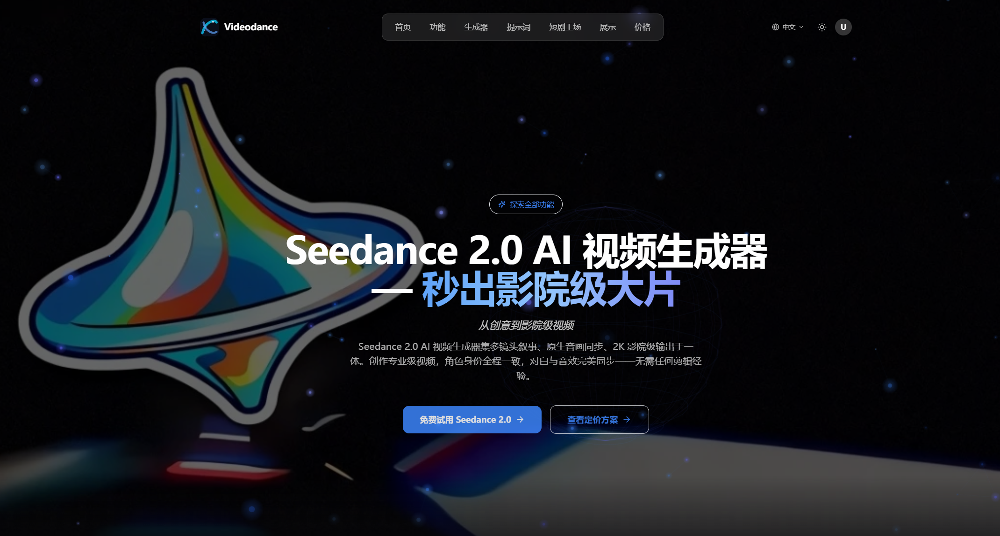
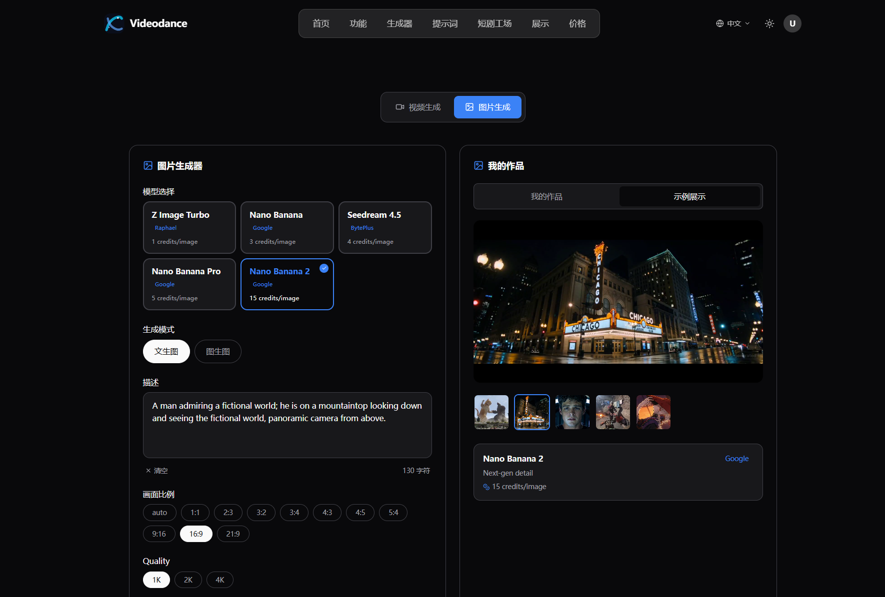
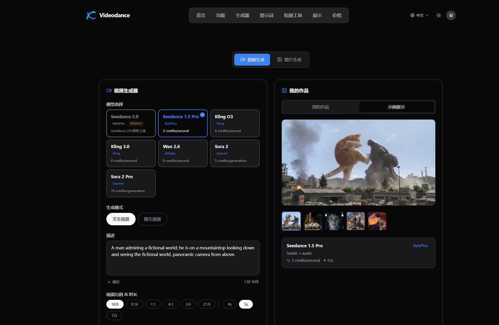
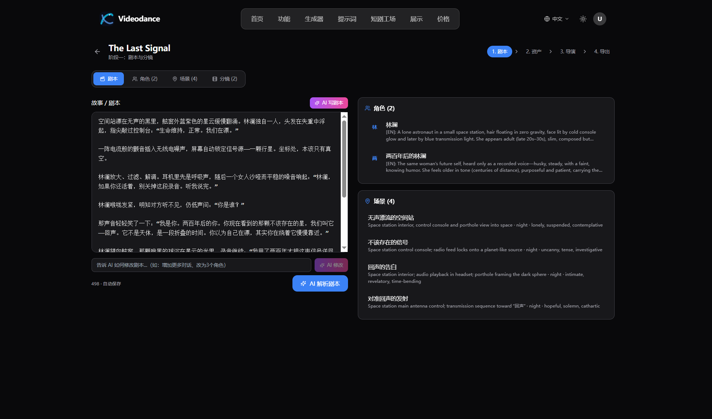
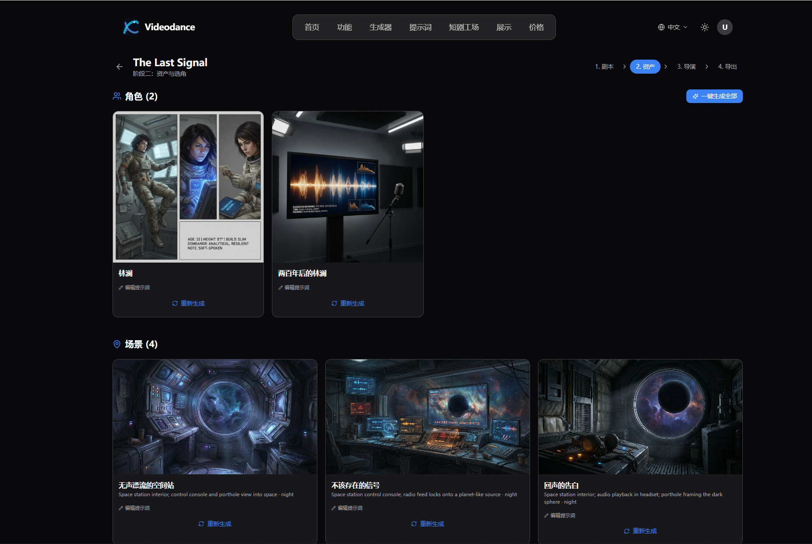
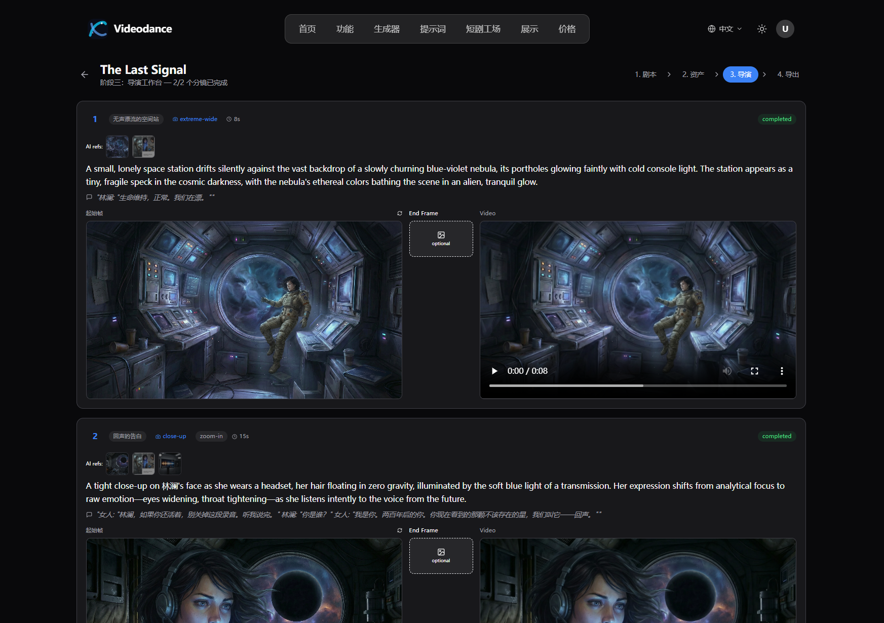
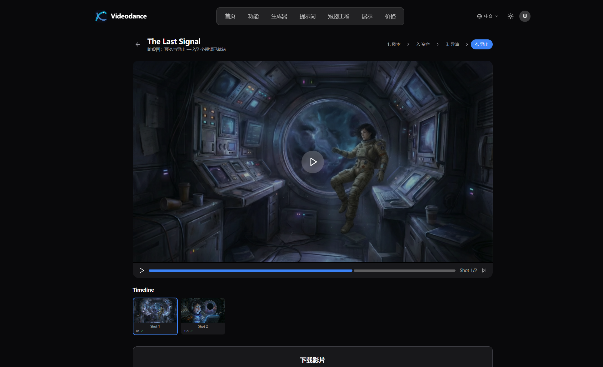

# VideoDance — From Idea to Film, Entirely with AI

Most AI tools give you a single capability and leave the rest to you. VideoDance is different. It's a complete creative platform that covers the full production pipeline — from a rough story concept to finished video — without requiring you to stitch together a dozen separate tools.

---

## Image Generation

The image side of VideoDance runs on eleven models, each suited to a different kind of output. Nano Banana 2 handles photorealistic portraits with a level of detail that holds up at 4K. Seedream 4.5 leans toward cinematic compositions — the kind of frame you'd actually want as a film still. Qwen Image Edit is built for precision work: swap an element, repaint a background, or correct a specific region without touching the rest of the image.

Text-to-image and image-to-image workflows are both supported. You can describe what you want, upload a reference and transform it, or do both in sequence. The output quality is consistent enough to use directly in professional projects.

---

## Video Generation

VideoDance integrates five of the leading video generation models: Sora 2, Kling O3, Kling 3.0, Seedance 2.0, and Wan 2.6. That range matters in practice. Sora 2 Pro delivers the most photorealistic motion — skin, fabric, water all behave like real material. Kling O3 excels at high-energy scenes where the camera and subject are both moving fast. Seedance 2.0 is the go-to for production work where turnaround speed matters more than absolute visual fidelity.

All of them support both text-to-video and image-to-video. You provide either a description or a reference frame, and the model generates a 5-to-10 second clip. Clips can be chained together to build longer sequences. Resolution goes up to 4K.

---

## AI Studio — Short Drama Production

This is the feature that sets VideoDance apart. AI Studio is a structured production pipeline for short-form drama — the kind of 10-shot narrative content that's become a major format on short video platforms. It walks you through each stage in order, so you always know exactly where you are in the process.

**Script.** You describe your story in plain language. The system generates a complete 10-shot script with scene descriptions, character dialogue, and camera direction. Edit any part of it before moving on.

**Characters.** The platform creates portrait images for each character in the script. These aren't one-off generations — the same character design is carried through every subsequent step, which solves one of the biggest practical problems with AI-generated narrative content.

**Scenes.** Each scene in the script gets a concept illustration. This is where you lock the visual style before committing to the render: the color palette, the setting, the lighting approach.

**Keyframes.** Shot-by-shot images are generated for the entire project in sequence. You can review composition and pacing before any video is rendered, and regenerate individual shots if something isn't working.

**Videos.** Each keyframe is rendered into a video clip. Seedance 2.0 is the default — it gets through a 10-shot project quickly and the output is solid. Kling O3 is available for projects where you need premium visual quality.

**Export.** Individual shots and the full project package are available to download. Everything is organized by project in the dashboard.

---

## How It Fits Together

Subscriptions and credit packs work independently. A subscription gives you a monthly credit allocation that refreshes automatically — unused credits roll over up to double the monthly amount. Credit packs are one-time purchases with no expiry date; they stack on top of whatever subscription you have, or work standalone if you prefer not to subscribe. You can hold one active subscription at a time, but there's no limit on credit packs.

---

## Give It a Try

If you've been putting off starting a video project because the production pipeline felt too complex, VideoDance is worth a serious look. The platform doesn't offer a free tier — every feature requires credits — but the entry-level packs are priced to let you test the full workflow without a large upfront commitment. Once you've run through a complete AI Studio project from script to export, the value of having the entire pipeline in one place becomes clear.

[videodance.cc](https://videodance.cc)
